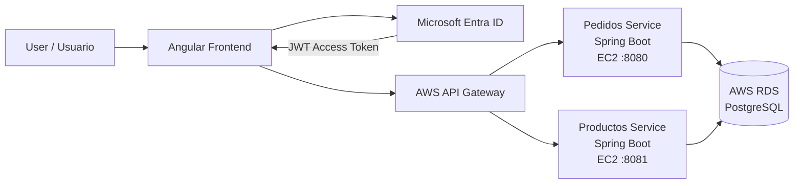

# Pedidos360

Full-stack order management platform built with Angular and Spring Boot microservices, secured with Microsoft Entra ID using JWT and RBAC, and deployed on AWS using API Gateway, EC2 and PostgreSQL RDS.

Plataforma full-stack de gestión de pedidos desarrollada con Angular y microservicios Spring Boot, protegida mediante Microsoft Entra ID con JWT y RBAC, y desplegada en AWS utilizando API Gateway, EC2 y PostgreSQL RDS.

---

## Architecture / Arquitectura



The frontend authenticates users through Microsoft Entra ID and sends JWT access tokens with requests. API Gateway routes requests to the corresponding Spring Boot microservice running on Amazon EC2. Both services persist data in PostgreSQL hosted on Amazon RDS.

El frontend autentica a los usuarios mediante Microsoft Entra ID y envía tokens JWT en las solicitudes. API Gateway dirige cada petición al microservicio Spring Boot correspondiente desplegado en Amazon EC2. Ambos servicios almacenan sus datos en PostgreSQL mediante Amazon RDS.

---

## Main Features / Funcionalidades principales

- Authentication with Microsoft Entra ID.
- JWT validation in Spring Security.
- Role-Based Access Control (RBAC).
- `PEDIDOS_ADMIN` application role.
- Protected Angular routes using MSAL Guard.
- Automatic JWT injection using MSAL Interceptor.
- Order creation, listing and deletion.
- Product creation and listing.
- Two independent Spring Boot microservices.
- REST API exposed through AWS API Gateway.
- Cloud-hosted PostgreSQL database.
- Persistent backend services using `systemd` on EC2.

---

## Technology Stack / Tecnologías

### Frontend

- Angular 21
- TypeScript
- MSAL Angular
- Microsoft Entra ID

### Backend

- Java 21
- Spring Boot
- Spring Web
- Spring Data JPA
- Spring Security
- OAuth2 Resource Server
- Maven

### Cloud

- AWS API Gateway
- Amazon EC2
- Amazon RDS
- PostgreSQL
- AWS Security Groups

### Security

- OAuth 2.0
- JWT
- Microsoft Entra ID
- RBAC
- Spring Security

---

## Microservices / Microservicios

### Pedidos Service

Responsible for order management.

Responsable de la gestión de pedidos.

```text
GET    /api/pedidos
GET    /api/pedidos/{id}
POST   /api/pedidos
PUT    /api/pedidos/{id}
DELETE /api/pedidos/{id}
```

Runs on:

```text
EC2 :8080
```

### Productos Service

Responsible for product management.

Responsable de la gestión de productos.

```text
GET    /api/productos
GET    /api/productos/{id}
POST   /api/productos
PUT    /api/productos/{id}
DELETE /api/productos/{id}
```

Runs on:

```text
EC2 :8081
```

---

## Security / Seguridad

Microsoft Entra ID acts as the Identity Provider.

The Angular frontend authenticates users through MSAL and obtains an access token containing scopes and application roles.

Spring Boot validates each JWT using Spring Security OAuth2 Resource Server.

The application implements:

```text
Scope:
access_as_user

Role:
PEDIDOS_ADMIN
```

Administrative operations such as creating, updating or deleting resources require the corresponding application role.

---

## AWS Deployment / Despliegue AWS

The project uses the following cloud architecture:

```text
Angular
   |
   | HTTPS + JWT
   v
AWS API Gateway
   |
   +----------------------+
   |                      |
   v                      v
Pedidos Service      Productos Service
EC2 :8080            EC2 :8081
   |                      |
   +----------+-----------+
              |
              v
        PostgreSQL
          AWS RDS
```

Both Spring Boot applications run as Linux `systemd` services, allowing them to continue running independently of SSH sessions.

---

## Repository Structure / Estructura del repositorio

```text
pedidos360/
│
├── pedidos360-frontend/
│   └── Angular application
│
├── pedidos-service/
│   └── Spring Boot order microservice
│
├── productos-service/
│   └── Spring Boot product microservice
│
├── .gitignore
└── README.md
```

---

## Project Status / Estado del proyecto

Core cloud architecture and functionality completed.

Arquitectura cloud y funcionalidades principales completadas.

Validated flow:

```text
Angular
→ Microsoft Entra ID
→ JWT
→ AWS API Gateway
→ Spring Boot Microservices on EC2
→ PostgreSQL on AWS RDS
```

---

## Author / Autor

Developed as a full-stack and cloud architecture project using modern authentication, microservices and AWS infrastructure.

Desarrollado como proyecto full-stack y de arquitectura cloud utilizando autenticación moderna, microservicios e infraestructura AWS.