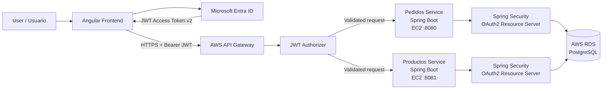

# Pedidos360

Full-stack order management platform built with Angular and Spring Boot microservices, secured with Microsoft Entra ID using OAuth 2.0, JWT and RBAC, and integrated with AWS API Gateway, Amazon EC2 and PostgreSQL RDS.

Plataforma full-stack de gestión de pedidos desarrollada con Angular y microservicios Spring Boot, protegida mediante Microsoft Entra ID utilizando OAuth 2.0, JWT y RBAC, e integrada con AWS API Gateway, Amazon EC2 y PostgreSQL RDS.

---

## Architecture / Arquitectura



The frontend authenticates users through Microsoft Entra ID using MSAL and obtains OAuth 2.0 JWT access tokens.

Requests are sent to AWS API Gateway, where a JWT Authorizer validates the token before routing the request to the corresponding Spring Boot microservice running on Amazon EC2.

Each Spring Boot service also validates the JWT through Spring Security OAuth2 Resource Server before allowing access to protected resources.

Both services persist their data in PostgreSQL hosted on Amazon RDS.

---

El frontend autentica a los usuarios mediante Microsoft Entra ID utilizando MSAL y obtiene tokens de acceso JWT mediante OAuth 2.0.

Las solicitudes son enviadas a AWS API Gateway, donde un JWT Authorizer valida el token antes de dirigir la petición al microservicio Spring Boot correspondiente desplegado en Amazon EC2.

Cada microservicio vuelve a validar el JWT mediante Spring Security OAuth2 Resource Server antes de permitir el acceso a los recursos protegidos.

Ambos servicios almacenan sus datos en PostgreSQL mediante Amazon RDS.

---

## Main Features / Funcionalidades principales

- Authentication with Microsoft Entra ID.
- OAuth 2.0 JWT Access Tokens v2.
- AWS API Gateway JWT Authorizer.
- JWT validation in Spring Security.
- Double-layer token validation: API Gateway + Spring Boot.
- Role-Based Access Control (RBAC).
- `PEDIDOS_ADMIN` and `PEDIDOS_USER` application roles.
- `access_as_user` OAuth scope.
- Protected Angular routes using MSAL Guard.
- Automatic JWT injection using MSAL Interceptor.
- Order creation, listing and deletion.
- Product creation and listing.
- Two independent Spring Boot microservices.
- REST API exposed through AWS API Gateway.
- CORS configured for the Angular frontend.
- Explicit `OPTIONS` routes for browser preflight requests.
- Cloud-hosted PostgreSQL database using Amazon RDS.
- Persistent backend services using `systemd` on Amazon EC2.
- Environment variables used for database credentials.
- GitHub repository configured to exclude sensitive and generated files.

---

## Technology Stack / Tecnologías

### Frontend

- Angular 21
- TypeScript
- MSAL Angular
- MSAL Browser
- Microsoft Entra ID

### Backend

- Java 21
- Spring Boot
- Spring Web
- Spring Data JPA
- Spring Security
- OAuth2 Resource Server
- Maven

### Cloud

- AWS API Gateway
- JWT Authorizer
- Amazon EC2
- Amazon RDS
- PostgreSQL
- AWS Security Groups
- Amazon Linux 2023
- Linux systemd

### Security

- OAuth 2.0
- JWT Access Tokens v2
- Microsoft Entra ID
- RBAC
- OAuth scopes
- API Gateway JWT validation
- Spring Security JWT validation
- CORS

---

## Frontend Authentication / Autenticación Frontend

The Angular frontend uses MSAL to authenticate users against Microsoft Entra ID.

Protected routes are guarded with `MsalGuard`, preventing unauthenticated users from accessing internal application pages.

The application uses `MsalInterceptor` so access tokens are automatically attached to protected HTTP requests.

The frontend requests the following API scope:

```text
access_as_user
```

Authenticated access tokens contain claims such as:

```text
iss
aud
scp
roles
exp
```

The validated token includes:

```text
Scope:
access_as_user

Role:
PEDIDOS_ADMIN
```

The API application is configured to issue Microsoft Entra ID Access Tokens v2.

---

El frontend Angular utiliza MSAL para autenticar usuarios mediante Microsoft Entra ID.

Las rutas privadas se encuentran protegidas mediante `MsalGuard`, evitando que usuarios no autenticados accedan directamente a las páginas internas.

Además, utilizamos `MsalInterceptor` para incorporar automáticamente el access token en las solicitudes HTTP dirigidas a recursos protegidos.

El frontend solicita el scope:

```text
access_as_user
```

Los tokens obtenidos incluyen información como issuer, audience, scope, roles y fecha de expiración.

---

## Microservices / Microservicios

### Pedidos Service

Responsible for order management.

Responsable de la gestión de pedidos.

```text
GET    /api/pedidos
GET    /api/pedidos/{id}
POST   /api/pedidos
PUT    /api/pedidos/{id}
DELETE /api/pedidos/{id}
```

Runs on:

```text
EC2 :8080
```

Main layers:

```text
Controller
Service
Repository
Entity
Security
```

---

### Productos Service

Responsible for product management.

Responsable de la gestión de productos.

```text
GET    /api/productos
GET    /api/productos/{id}
POST   /api/productos
PUT    /api/productos/{id}
DELETE /api/productos/{id}
```

Runs on:

```text
EC2 :8081
```

Main layers:

```text
Controller
Service
Repository
Entity
Security
```

---

## Security / Seguridad

Microsoft Entra ID acts as the Identity Provider for Pedidos360.

The security flow is divided into multiple layers.

```text
User
↓
Microsoft Entra ID
↓
JWT Access Token v2
↓
Angular + MSAL
↓
AWS API Gateway JWT Authorizer
↓
Spring Security OAuth2 Resource Server
↓
Protected REST endpoint
```

### API Scope

```text
access_as_user
```

API Gateway requires this scope on protected application routes.

### Application Roles

```text
PEDIDOS_ADMIN
PEDIDOS_USER
```

Spring Security maps the roles contained in the JWT and applies authorization rules to protected operations.

Administrative operations can therefore require:

```text
ROLE_PEDIDOS_ADMIN
```

while authenticated API access can be controlled through:

```text
SCOPE_access_as_user
```

---

## JWT Validation / Validación JWT

JWT validation is performed at two different layers.

### 1. AWS API Gateway

A JWT Authorizer was configured with Microsoft Entra ID as issuer.

API Gateway validates the incoming access token before forwarding the request to EC2.

The authorizer uses:

```text
Identity source:
$request.header.Authorization

Issuer:
Microsoft Entra ID v2 endpoint

Audience:
Pedidos360 API Client ID

Required scope:
access_as_user
```

This prevents requests containing missing or invalid JWT tokens from reaching the protected backend routes.

An invalid bearer token returns:

```text
HTTP 401 Unauthorized
error="invalid_token"
```

### 2. Spring Security

The Spring Boot microservices are configured as OAuth2 Resource Servers.

Each service independently validates the JWT received from API Gateway.

The backend validates security information including:

```text
Issuer
Audience
Signature
Expiration
Scopes
Roles
```

This means the backend does not rely exclusively on frontend authentication or API Gateway.

---

## CORS and Browser Preflight

Because the Angular frontend runs from:

```text
http://localhost:4200
```

AWS API Gateway was configured to allow requests from this origin.

Allowed methods:

```text
GET
POST
PUT
DELETE
OPTIONS
```

Allowed headers:

```text
Authorization
Content-Type
```

Explicit unauthenticated `OPTIONS` routes were also created for browser preflight requests:

```text
OPTIONS /api/pedidos
OPTIONS /api/pedidos/{id}
OPTIONS /api/productos
OPTIONS /api/productos/{id}
```

These routes allow the browser to complete the CORS preflight without requiring a JWT, while the actual application operations remain protected by the JWT Authorizer.

Validated browser flow:

```text
OPTIONS → 200
GET     → 200
DELETE  → 204
```

---

## AWS API Gateway

AWS API Gateway acts as the entry point for the backend services.

Protected routes:

```text
ANY /api/pedidos
ANY /api/pedidos/{id}

ANY /api/productos
ANY /api/productos/{id}
```

These routes require:

```text
JWT Authorizer:
Pedidos360-JWT

Authorization scope:
access_as_user
```

Routing:

```text
/api/pedidos*
→ Pedidos Service
→ EC2 :8080

/api/productos*
→ Productos Service
→ EC2 :8081
```

Request path forwarding is configured using:

```text
$request.path
```

This preserves the original REST path when API Gateway forwards the request to Spring Boot.

---

## AWS Deployment / Despliegue AWS

The backend uses the following cloud architecture:

```text
Angular Frontend
        |
        | HTTPS + JWT
        v
AWS API Gateway
        |
        | JWT Authorizer
        |
        +-------------------------+
        |                         |
        v                         v
Pedidos Service             Productos Service
Spring Boot                 Spring Boot
EC2 :8080                   EC2 :8081
        |                         |
        | Spring Security         | Spring Security
        +------------+------------+
                     |
                     v
                PostgreSQL
                  AWS RDS
```

The Angular frontend is executed locally for the evaluation and communicates with the backend infrastructure deployed on AWS.

Both Spring Boot applications run as Linux `systemd` services.

Configured services:

```text
pedidos360-pedidos.service
pedidos360-productos.service
```

This allows both microservices to start automatically when the EC2 instance starts and continue running independently of SSH sessions.

---

## Database / Base de datos

Amazon RDS with PostgreSQL is used as the persistent database layer.

The microservices use:

```text
Spring Data JPA
Hibernate
PostgreSQL Driver
```

Each service has its own entities and repositories.

Main tables:

```text
pedidos
productos
```

Database credentials are not hardcoded in the source code.

Spring Boot reads connection information using environment variables:

```properties
spring.datasource.url=jdbc:postgresql://${DB_HOST}:5432/postgres?sslmode=require
spring.datasource.username=${DB_USER}
spring.datasource.password=${DB_PASSWORD}
```

On EC2 these variables are loaded externally by the Linux services.

The RDS Security Group allows PostgreSQL traffic on port `5432` from the EC2 Security Group.

---

## Functional Validation / Validación funcional

The complete system flow was tested end-to-end.

### Orders

Validated operations include:

```text
Angular
→ MSAL
→ JWT Access Token v2
→ API Gateway JWT Authorizer
→ Spring Security
→ Pedidos Service
→ Spring Data JPA
→ PostgreSQL RDS
```

Successful tests include:

```text
GET    /api/pedidos      → 200
POST   /api/pedidos      → successful
DELETE /api/pedidos/{id} → 204
```

A temporary order was created and deleted successfully using a user whose JWT contained the `PEDIDOS_ADMIN` role.

### Products

The product service was also validated through the complete AWS architecture.

```text
OPTIONS /api/productos → 200
GET /api/productos     → 200
```

Persisted product data was successfully recovered from Amazon RDS through the microservice deployed on EC2.

### Invalid Token

A request containing an invalid bearer token was rejected by API Gateway:

```text
HTTP/2 401
error="invalid_token"
{"message":"Unauthorized"}
```

This confirms that the gateway validates the JWT before forwarding protected requests.

---

## Build Validation / Validación de compilación

The Angular frontend was successfully compiled using:

```bash
ng build
```

Both Spring Boot services were successfully packaged using:

```bash
mvn clean package -DskipTests
```

Result:

```text
BUILD SUCCESS
```

The generated `.jar` files were then deployed to Amazon EC2.

---

## Repository Security / Seguridad del repositorio

The repository uses `.gitignore` rules to avoid committing generated files and sensitive information.

Ignored content includes:

```text
node_modules/
dist/
target/
.env
*.env
*.pem
*.key
*.log
```

The repository was also reviewed for hardcoded passwords and secrets.

Database configuration references environment variables instead of storing credentials directly in GitHub.

---

## Repository Structure / Estructura del repositorio

```text
pedidos360/
│
├── pedidos360-frontend/
│   └── Angular application
│
├── pedidos-service/
│   └── Spring Boot order microservice
│
├── productos-service/
│   └── Spring Boot product microservice
│
├── .gitignore
└── README.md
```

---

## Project Status / Estado del proyecto

Core cloud architecture, security and application functionality completed.

Arquitectura cloud, seguridad y funcionalidades principales completadas.

Validated final flow:

```text
User
→ Angular
→ Microsoft Entra ID
→ JWT Access Token v2
→ MSAL Interceptor
→ AWS API Gateway
→ JWT Authorizer
→ access_as_user
→ Spring Security
→ RBAC
→ Spring Boot Microservices on EC2
→ Spring Data JPA
→ PostgreSQL on Amazon RDS
```

Validated security behavior:

```text
Valid authenticated request → 200

Administrative DELETE
with PEDIDOS_ADMIN          → 204

Invalid JWT                 → 401

Browser CORS preflight      → 200
```

---

## Author / Autor

Developed as a full-stack and cloud architecture project using Angular, Spring Boot microservices, Microsoft Entra ID authentication and AWS infrastructure.

Desarrollado como proyecto full-stack y de arquitectura cloud utilizando Angular, microservicios Spring Boot, autenticación mediante Microsoft Entra ID e infraestructura AWS.